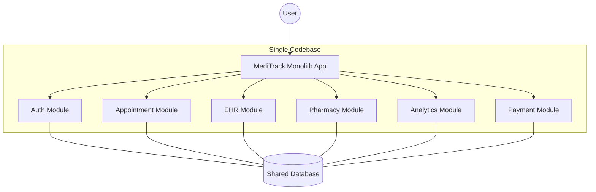
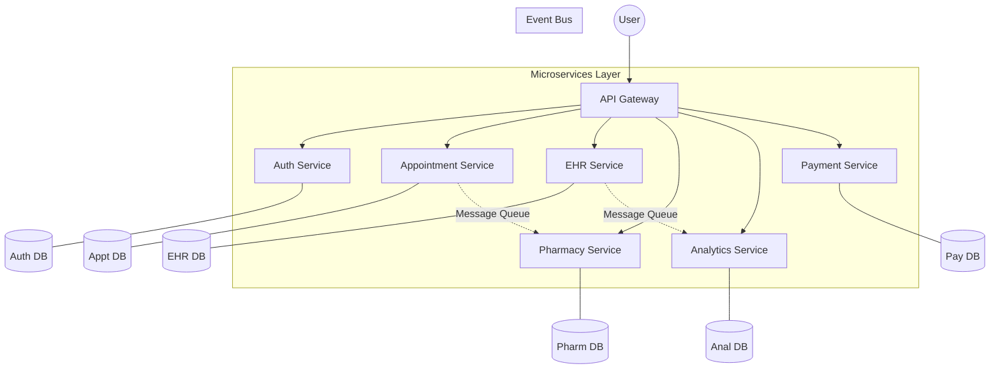

# Laporan Arsitektur: MediTrack Transformation (Case Study 2)

## Skenario Transformasi
Sesuai rancangan pada **Case Study 1**, MediTrack saat ini diimplementasikan sebagai aplikasi **Modular Monolith berbasis PHP (Laravel)**. Semua modul (Auth/User, Appointment, EHR, Pharmacy, Analytics, Payment) tergabung dalam satu codebase dan dapat berjalan dengan baik. Namun, seiring dengan target ekspansi rumah sakit ke berbagai wilayah, perusahaan memutuskan untuk berevolusi menuju **Arsitektur Microservices** guna memastikan skalabilitas tanpa batas, isolasi kegagalan, dan kemudahan pemeliharaan lintas tim.
## 1. Use Cases (Kasus Penggunaan)
Berdasarkan studi kasus MediTrack, berikut adalah kasus penggunaan utama untuk setiap modul:

| Modul | Deskripsi Kasus Penggunaan (Use Case) |
| :--- | :--- |
| **Auth / User** | Mengelola autentikasi pengguna (login/logout), pendaftaran pasien baru, dan manajemen peran (role-based access control). |
| **Appointment** | Pasien dapat menjadwalkan pertemuan dengan dokter, mengecek ketersediaan jadwal, dan membatalkan atau menjadwal ulang pertemuan. |
| **EHR (Electronic Health Record)** | Dokter dapat mencatat riwayat medis pasien, melihat riwayat pengobatan sebelumnya, dan memperbarui catatan kesehatan secara real-time. |
| **Pharmacy** | Mengelola stok obat-obatan di apotek, memproses resep dari modul EHR, dan memperbarui inventaris setelah obat dikeluarkan. |
| **Analytics** | Menghasilkan laporan tren kunjungan pasien, efisiensi operasional rumah sakit, dan analisis pendapatan bulanan. |
| **Payment** | Memproses pembayaran layanan medis, menghasilkan invoice, dan mengelola integrasi dengan asuransi atau gateway pembayaran eksternal. |

---

## 2. Architecture Diagram (Diagram Arsitektur)

### A. Arsitektur Monolith (Lama)
Pada arsitektur ini, semua modul berada dalam satu codebase yang sama dan berbagi database yang sama secara langsung.

### B. Arsitektur Microservices (Baru)
Pada arsitektur ini, setiap modul dipisahkan menjadi layanan independen yang memiliki database sendiri-sendiri (Database per Service) dan berkomunikasi melalui API atau Message Broker.

---

## 3. Reasoning & Trade-offs (Alasan & Pertimbangan)

### Alasan Transformasi:
1.  **Scalability (Skalabilitas)**: Kita dapat melakukan scaling pada modul yang paling sibuk (misalnya `Appointment`) tanpa harus melakukan scaling pada seluruh aplikasi.
2.  **Maintainability (Kemudahan Pemeliharaan)**: Codebase yang lebih kecil di setiap service lebih mudah dipahami dan dikembangkan oleh tim yang berbeda secara paralel.
3.  **Fault Isolation (Isolasi Kesalahan)**: Jika modul `Analytics` mengalami error, modul `Appointment` dan `Payment` tetap dapat berjalan normal.
4.  **Technology Agnostic**: Setiap service bisa menggunakan teknologi yang berbeda jika diperlukan (misal: Python untuk Analytics, PHP untuk Auth).

### Trade-offs (Pertimbangan):
*   **Operational Complexity**: Mengelola 6 layanan jauh lebih sulit daripada mengelola 1 layanan (perlu manajemen container, service discovery, dll).
*   **Network Latency**: Komunikasi antar service melalui jaringan lebih lambat dibandingkan pemanggilan method langsung di memori (Monolith).
*   **Data Consistency**: Menjaga integritas data antar database yang terpisah memerlukan mekanisme kompensasi (seperti Saga Pattern) karena tidak ada lagi transaksi ACID lintas DB.

---

## 4. Migration Strategy (Strategi Migrasi)

Strategi yang direkomendasikan adalah **Strangler Fig Pattern**:

1.  **Fase 1: Identifikasi Boundaries**: Menentukan domain masing-masing modul (Bounded Context).
2.  **Fase 2: Ekstraksi Bertahap**: Memulai ekstraksi modul yang paling sederhana atau memiliki dependensi paling sedikit (misal: `Auth` atau `Analytics`).
3.  **Fase 3: Proxy/Gateway**: Menggunakan API Gateway sebagai perantara (router) yang mengarahkan traffic ke Monolith atau ke Microservice yang baru dibuat.
4.  **Fase 4: Database Splitting**: Memisahkan skema database secara bertahap hingga setiap service memiliki database independen.
5.  **Fase 5: Decommissioning**: Menghapus kode lama di Monolith setelah fungsionalitasnya sepenuhnya dipindahkan ke Microservices.
