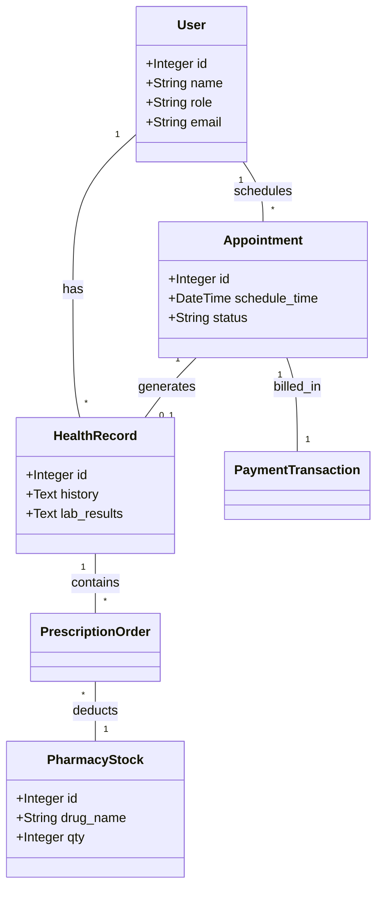

# Laporan Pengembangan Platform MediTrack - Case Study 1

## 2. Design Thinking & Architecture Selection

Sebagai lead architect, saya mengusulkan arsitektur **Modular Monolith** untuk platform MediTrack. Meskipun tantangan pertumbuhan cepat biasanya dikaitkan dengan Microservices, pendekatan Modular Monolith adalah pilihan yang lebih pragmatis dan efisien untuk fase awal hingga menengah pengembangan aplikasi berbasis Laravel.

### a. Justifikasi Pilihan (Prinsip Arsitektur)
1.  **Simplicity & Development Speed**: Dengan satu codebase dan satu database, tim pengembang dapat bergerak lebih cepat dalam melakukan iterasi fitur tanpa harus mengelola kompleksitas orkestrasi layanan, penemuan layanan (*service discovery*), dan penyeimbangan beban (*load balancing*) antar layanan.
2.  **Strong Data Consistency (ACID)**: Dalam sistem kesehatan, integritas data sangat krusial (misal: sinkronisasi antara janji temu dan ketersediaan dokter). Arsitektur Monolith memungkinkan kita menggunakan transaksi database tunggal yang atomik, menghindari masalah *distributed transactions* (seperti saga pattern) yang rumit.
3.  **Low Operational Overhead**: Mengurangi beban biaya infrastruktur dan pemeliharaan operasional. Satu unit deployment berarti pemantauan, logging, dan pipeline CI/CD yang lebih sederhana.

### b. Trade-offs & Batasan
-   **Technology Lock-in**: Seluruh sistem harus menggunakan tumpukan teknologi yang sama (PHP/Laravel).
-   **Resource Scaling**: Skalabilitas dilakukan secara vertikal atau horizontal untuk seluruh aplikasi, tidak bisa per komponen. Jika modul analitik memakan banyak memori, seluruh instansi aplikasi harus ditingkatkan kapasitasnya.
-   **Deployment Risk**: Bug kecil di satu modul (misal: modul farmasi) berpotensi menyebabkan seluruh aplikasi mati jika tidak ditangani dengan *error handling* yang baik.

### c. Skalabilitas, Maintainability, & Extensibility
-   **Scalability**: Platform dapat diskalakan secara horizontal dengan menjalankan beberapa instansi di belakang Load Balancer. Penggunaan Redis untuk session dan cache memastikan aplikasi bersifat *stateless*.
-   **Maintainability**: Dengan mengikuti pola *Domain-Driven Design (DDD)* di dalam struktur folder Laravel (modul terpisah), ketergantungan antar modul diminimalkan sehingga kode mudah dipelihara.
-   **Extensibility**: Integrasi fitur baru dapat dilakukan dengan menambahkan modul/folder baru tanpa merivisi arsitektur inti.

---

## 3. System Decomposition & Modeling

Sistem MediTrack dipecah menjadi modul-modul logika berbasis domain berikut:

### a. Modul & Tanggung Jawab
| Modul | Tanggung Jawab |
| :--- | :--- |
| **User & Identity** | Autentikasi, otorisasi RBAC (Patient, Doctor, Pharmacist, Admin). |
| **Appointment** | Manajemen jadwal dokter, booking, penjadwalan ulang, dan pembatalan. |
| **Clinical/EHR** | Penyimpanan riwayat medis, hasil lab, dan resep digital (Electronic Health Records). |
| **Pharmacy** | Manajemen stok obat dan pemrosesan pesanan resep dari dokter. |
| **Payment & Billing** | Integrasi pembayaran online dan klaim asuransi. |
| **Analytics** | Pemrosesan statistik performa dan penggunaan obat (biasanya diproses di background). |

### b. Entitas Utama & Hubungan
-   **User**: Entitas pusat dengan relasi `hasMany` ke Appointment dan HealthRecord.
-   **Appointment**: Menghubungkan Patient, Doctor, dan HealthRecord.
-   **HealthRecord**: Berisi detail klinis dan berelasi dengan Prescription.
-   **PrescriptionOrder**: Menghubungkan HealthRecord dengan PharmacyStock.
-   **PaymentTransaction**: Mencatat pembayaran untuk Appointment atau Prescription.

### c. UML Class Diagram (Conceptual)


---

## 4. Architecture Visualization

Berikut adalah visualisasi arsitektur tingkat tinggi dari sistem MediTrack:


---

## 5. Implementasi

Implementasi berbasis Laravel mengikuti pola MVC yang terorganisir. Berikut adalah struktur inti dan cuplikan logika utamanya.

### Struktur Proyek Utama
-   **Models**: `User.php`, `Appointment.php`, `HealthRecord.php`, `PharmacyStock.php`, `PrescriptionOrder.php`, `PaymentTransaction.php`.
-   **Controllers**: Terpisah per domain (misal: `AppointmentController`, `PharmacyController`).
-   **Migrations**: Skema database yang mendukung integritas data antar modul.

### Cuplikan Kode Core (Contoh: Appointment Booking)
```php
// app/Http/Controllers/AppointmentController.php
public function store(Request $request) {
    DB::transaction(function () use ($request) {
        $appointment = Appointment::create([
            'patient_id' => auth()->id(),
            'doctor_id' => $request->doctor_id,
            'appointment_date' => $request->date,
            'status' => 'scheduled'
        ]);
        
        // Integrasi Otomatis Modul Payment
        PaymentTransaction::create([
            'appointment_id' => $appointment->id,
            'amount' => 50000,
            'status' => 'pending'
        ]);
    });
    return redirect()->back()->with('success', 'Janji temu berhasil dibuat.');
}
```

---

## 6. Hambatan Performa & Mitigasi

### Identifikasi Potensi Bottlenecks
1.  **Database Contention**: Saat banyak dokter dan pasien mengakses tabel `appointments` secara bersamaan di jam sibuk, terjadi penguncian baris (*row locking*) yang memperlambat sistem.
2.  **Synchronous External Calls**: Memanggil API Payment Gateway atau API Farmasi secara sinkron di dalam request utama akan meningkatkan latensi.
3.  **Heavy Analytics on Master DB**: Kueri untuk laporan analitik (Tren obat, performa dokter) dapat membebani kinerja database transaksional.

### Strategi Mitigasi
1.  **Database Indexing & Read Replicas**: Menambahkan index pada kolom `doctor_id` dan `appointment_date`, serta memisahkan kueri baca (analitik) ke database replika.
2.  **Asynchronous Background Jobs**: Menggunakan **Laravel Queues** (dengan Redis) untuk proses yang tidak butuh respon instan, seperti mengirim email notifikasi, rekonsiliasi stok, dan sinkronisasi data analitik.
3.  **Caching Strategy**: Menggunakan **Redis** untuk menyimpan data yang jarang berubah seperti daftar dokter dan modul farmasi (stok obat) guna mengurangi beban kueri ke database utama.
