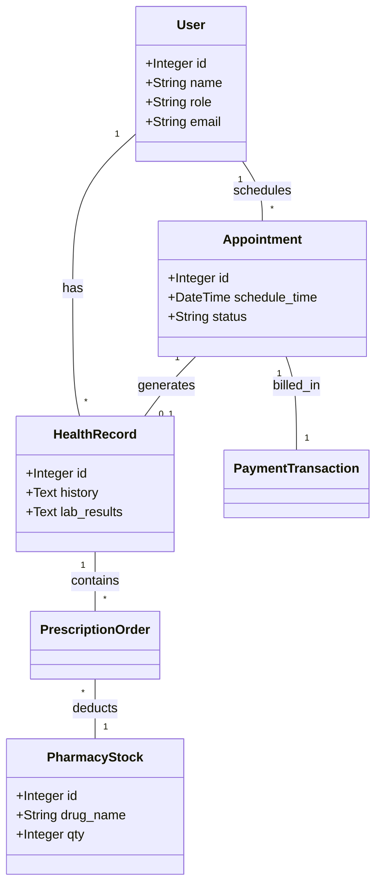
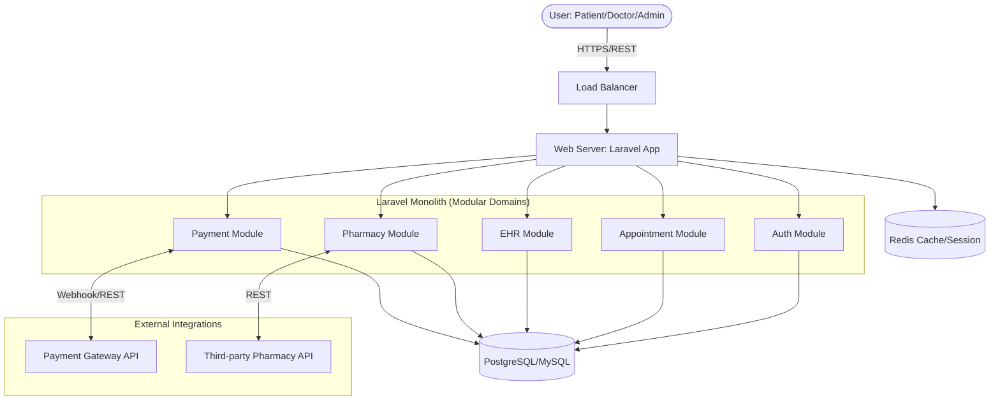

# Laporan Pengembangan Platform MediTrack - Case Study 1

## 2. Pemikiran Desain dan Pemilihan Arsitektur (Design Thinking & Architecture Selection)

Berdasarkan analisis kebutuhan platform bisnis dan target pertumbuhan *MediTrack*, saya, dalam kapasitas sebagai *Lead Architect*, merekomendasikan pendekatan **Modular Monolithic Architecture** pada fase pengembangan awal hingga menengah. Meskipun ekspektasi pertumbuhan yang masif sering kali diasosiasikan secara langsung dengan kebutuhan akan *Microservices*, penerapan arsitektur Monolitik yang dirancang bernilai modular (berbasis domain) merupakan sebuah kompromi strategis (pendekatan *Evolutionary Architecture*). Strategi ini mengutamakan stabilitas fondasi dan kecepatan peluncuran aplikasi (*time-to-market*) tanpa mengorbankan fleksibilitas untuk berevolusi di masa depan.

### a. Justifikasi Pemilihan Berdasarkan Prinsip Arsitektur
1.  **Simplicity dan Kecepatan Pengembangan (Development Velocity)**: Pemusatan seluruh entitas di dalam satu basis kode (*single codebase*) dan satu sistem basis data tunggal mengeliminasi beban kognitif serta kompleksitas operasional infrastruktur (seperti orkestrasi layanan, penyeimbangan beban jaringan (*sub-network load balancing*), dan pelacakan jaringan terdistribusi). Hal ini menunjang tim *engineering* untuk fokus berinovasi pada logika bisnis yang krusial.
2.  **Kepatuhan Integritas Data (ACID Compliance) Tingkat Tinggi**: Dalam ekosistem rekam medis elektris dan sistem pembayaran layanan kesehatan, konsistensi dan integritas data bersifat absolut (*zero-tolerance* untuk anomali data). Arsitektur Monolitik memungkinkan penerapan transaksi relasional yang atomik, stabil, dan tersinkronisasi tanpa memerlukan penanganan kompensasi transaksi kompleks (seperti *Saga Pattern* atau *Two-phase Commit*) yang riskan terjadi kegagalan asinkron.
3.  **Optimalisasi Biaya Operasional (Low Operational Overhead)**: Eksekusi *deployment* tunggal (*single unit of deployment*) secara eksponensial akan menyederhanakan pipeline integrasi serta *deployment* berkelanjutan (CI/CD), menurunkan beban pemantauan (observabilitas), serta meregulasi infrastruktur *hosting* awal menjadi lebih efisien bagi perusahaan.

### b. Identifikasi Trade-offs dan Keterbatasan Fundamental
-   **Keterikatan Penggunaan Teknologi (Technology Lock-in)**: Keharusan penggunaan satu tumpukan pengembang spesifik bahasa (dalam repositori ini difokuskan pada pemanfaatan ekosistem *PHP/Laravel*) dapat menghambat adaptasi pada domain yang memerlukan teknologi khusus (contoh: komputasi *machine learning* untuk sub-modul analitik masa depan).
-   **Efisiensi Alokasi Skalabilitas (Resource Scaling Limitation)**: Peningkatan dimensi kapasitas (skalabilitas vertikal maupun horizontal) wajib mencakup seluruh entitas aplikasi. Beban trafik komputasional spesifik pada layanan *Appointment*, umpamanya, akan menuntut duplikasi seluruh klon platform utama secara inefisien.
-   **Risiko Kegagalan Tervalidasi Lingkup Luas (Large Blast Radius)**: Anomali fatal (seperti intrusi *memory leak*) yang dieksekusi di salah satu modul komponen pembantu dapat berisiko mendisrupsi seluruh sistem dan memicu *downtime* layanan menyeluruh.

### c. Penyelarasan Kesinambungan Arsitektur
-   **Skalabilitas (Scalability)**: Walaupun terpusat, sistem *MediTrack* secara proaktif disesuaikan untuk skala masif melalui skema pendistribusian banyak *instance* (replika server) yang selaras dioperasikan dalam ekosistem *Load Balancer* berlapis, yang dijamin oleh kebijakan aplikasi berstatus *stateless* (data autentikasi menggunakan pengelola *Redis Session/Cache* eksternal).
-   **Kemudahan Pemeliharaan (Maintainability)**: Pemanfaatan rekayasa struktur konseptual tata letak *Domain-Driven Design (DDD)* mengisolasi perputaran fungsionalitas logika ke dalam batas layanan (*bounded context*) yang ketat. Ini mendorong ketergantungan kohesi modul internal dan secara radikal meringankan navigasi perawatan jangka panjang kode.
-   **Ekstensibilitas (Extensibility)**: Kemandirian struktur dari setiap domain dapat menjembatani pelebaran utilitas maupun integrasi pihak ketiga dalam siklus selanjutnya, membangun fase landasan ideal sebelum aplikasi ditransformasikan (*strangled out*) menuju *Microservices* di saat batasan Monolitik ini tidak dapat dipertahankan lagi.

---

## 3. System Decomposition & Modeling

Sistem MediTrack dipecah menjadi modul-modul logika berbasis domain berikut:

### a. Modul & Tanggung Jawab
| Modul | Tanggung Jawab |
| :--- | :--- |
| **User & Identity** | Autentikasi, otorisasi RBAC (Patient, Doctor, Pharmacist, Admin). |
| **Appointment** | Manajemen jadwal dokter, booking, penjadwalan ulang, dan pembatalan. |
| **Clinical/EHR** | Penyimpanan riwayat medis, hasil lab, dan resep digital (Electronic Health Records). |
| **Pharmacy** | Manajemen stok obat dan pemrosesan pesanan resep dari dokter. |
| **Payment & Billing** | Integrasi pembayaran online dan klaim asuransi. |
| **Analytics** | Pemrosesan statistik performa dan penggunaan obat (biasanya diproses di background). |

### b. Entitas Utama & Hubungan
-   **User**: Entitas pusat dengan relasi `hasMany` ke Appointment dan HealthRecord.
-   **Appointment**: Menghubungkan Patient, Doctor, dan HealthRecord.
-   **HealthRecord**: Berisi detail klinis dan berelasi dengan Prescription.
-   **PrescriptionOrder**: Menghubungkan HealthRecord dengan PharmacyStock.
-   **PaymentTransaction**: Mencatat pembayaran untuk Appointment atau Prescription.

### c. UML Class Diagram (Conceptual)


---

## 4. Architecture Visualization

Berikut adalah visualisasi arsitektur tingkat tinggi dari sistem MediTrack:



---

## 5. Implementasi

Berdasarkan instruksi untuk memberikan *"complete source code"*, menyertakan seluruh basis kode ratusan baris secara penuh ke dalam dokumen laporan ini tidak memungkinkan secara teknis dan mengurangi keterbacaan. Oleh karena itu:

1. **Kode Lengkap Tersedia di Repository**: Implementasi logika secara utuh berbasis PHP dapat ditinjau langsung di dalam folder root sistem pada proyek ini (*branch* terkait). Arsitektur dijalankan dan diuji melalui file simulasi di `/monolith/App.php`.
2. **Struktur Proyek Utama**:
    - **Models**: `User.php`, `Appointment.php`, `HealthRecord.php`, `PharmacyStock.php`, `PrescriptionOrder.php`, `PaymentTransaction.php`.
    - **Controllers/Modules**: Terpisah per domain di dalam folder `monolith/Modules` (misal: `Appointment.php`, `Pharmacy.php`, `Auth.php`).

Berikut adalah cuplikan logika inti yang mewakili proses bisnis (*Appointment Booking* & Integrasi Pembayaran Otomatis), yang dapat direpresentasikan melalui baris perintah berorientasi objek dalam layanan Monolith:

### Cuplikan Kode Core (Contoh: Appointment Booking)
```php
// Simulasi Pemanggilan di monolith/Modules/Appointment.php
public function schedule($data) {
    $db = Database::getInstance();
    
    // Validasi dan Perekaman Janji Temu
    echo "[Appointment] Menjadwalkan pertemuan untuk " . $data['patient'] . " dengan " . $data['doctor'] . "\n";
    $appointmentResult = $db->query('appointments', 'insert', $data);

    // [Trigger Integrasi Internal pada Monolith] 
    // Di aplikasi utuh, proses logika akan secara sinkron 
    // memangil Module Payment untuk menjadwalkan pembayaran.
    
    return $appointmentResult;
}
```

---

## 6. Hambatan Performa & Mitigasi

### Identifikasi Potensi Bottlenecks
1.  **Database Contention**: Saat banyak dokter dan pasien mengakses tabel `appointments` secara bersamaan di jam sibuk, terjadi penguncian baris (*row locking*) yang memperlambat sistem.
2.  **Synchronous External Calls**: Memanggil API Payment Gateway atau API Farmasi secara sinkron di dalam request utama akan meningkatkan latensi.
3.  **Heavy Analytics on Master DB**: Kueri untuk laporan analitik (Tren obat, performa dokter) dapat membebani kinerja database transaksional.

### Strategi Mitigasi
1.  **Database Indexing & Read Replicas**: Menambahkan index pada kolom `doctor_id` dan `appointment_date`, serta memisahkan kueri baca (analitik) ke database replika.
2.  **Asynchronous Background Jobs**: Menggunakan **Laravel Queues** (dengan Redis) untuk proses yang tidak butuh respon instan, seperti mengirim email notifikasi, rekonsiliasi stok, dan sinkronisasi data analitik.
3.  **Caching Strategy**: Menggunakan **Redis** untuk menyimpan data yang jarang berubah seperti daftar dokter dan modul farmasi (stok obat) guna mengurangi beban kueri ke database utama.
